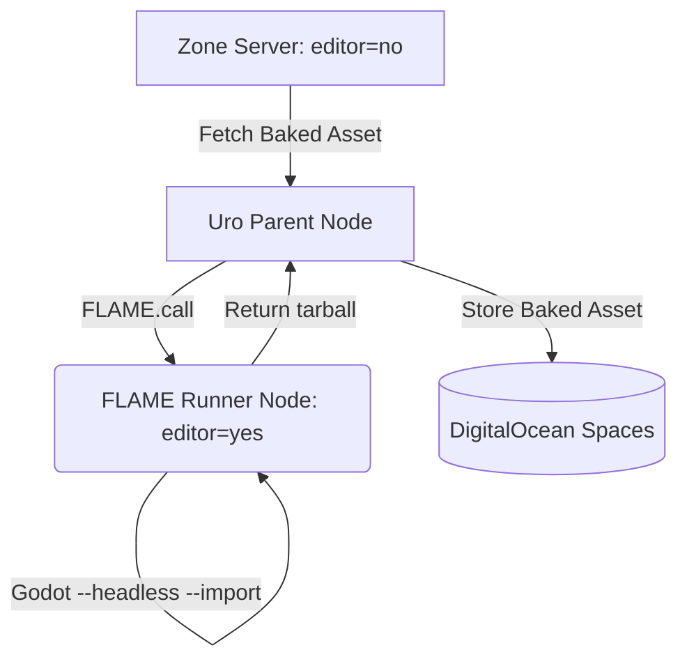

# Ephemeral Asset Baking (FLAME)

This document describes the **FLAME-driven** (Fleeting Lambda Application for Modular Execution) asset pipeline. By integrating Elixir FLAME directly into the `uro` backend, we can execute heavy Godot import operations on ephemeral Fly.io nodes.

## Overview
The baking process is managed as an elastic part of the `uro` application. When a raw asset needs processing, `uro` spawns a temporary Fly.io machine (a "Runner") using the **SCons `editor=yes` build**. This runner executes the Godot headless import and returns the results to the parent node.

## Architecture



## Implementation

### 1. FLAME Pool Configuration (Dedicated Editor Node)
In `uro/application.ex`, we define a dedicated pool for asset processing. This pool uses a specialized container image containing the editor-enabled binary:
```elixir
{FLAME.Pool,
 name: Uro.AssetBaker,
 backend: {FLAME.FlyBackend, 
   image: "registry.fly.io/multiplayer-fabric-uro:editor-latest", # SCons editor=yes build
   env: %{"GODOT_MODE" => "baker"}
 },
 min: 0,
 max: 10,
 cpu_kind: "performance-2x",
 memory_mb: 4096,
 idle_shutdown_after: 30_000}
```

### 2. The Baking Logic (`Uro.Baker`)
The logic executes the `editor` binary in headless mode to perform the bake. These nodes are **disconnected from the Hilbert grid**:
```elixir
defmodule Uro.Baker do
  def bake_asset(raw_data) do
    FLAME.call(Uro.AssetBaker, fn ->
      # Executed on an ephemeral Fly Machine with SCons editor=yes
      # 1. godot --headless --path . --import
      # 2. Return the tarballed .godot/imported folder
    end)
  end
end
```

```

### 3. Benefits of the FLAME Pattern
- **Zero-Boilerplate Scaling:** No separate Dockerfiles or Fly configurations for the baker. It uses the exact same deployment image as the `uro` backend.
- **Integrated Auth:** Since the runner is part of the `uro` cluster, authentication is handled via internal BEAM distribution and certificates.
- **State Management:** The parent node receives the baked binary directly, allowing for immediate database updates and cleanup.

## Advantages for Bloom Power
- **Efficiency:** Machines are spawned in ~2-3 seconds and destroyed immediately after the `FLAME.call` returns.
- **Resource Isolation:** Physics-heavy baking is offloaded from the `uro` API nodes, preventing request latency spikes.
- **Simplified Deployment:** Your CI/CD only needs to manage one application (`uro`) while gaining horizontal scaling for background tasks.

## Security Model

## Security Model

- **Auth:** The microservice utilizes standard mTLS authentication. It presents its machine-specific operational certificate to the `Uro` backend for all storage operations.
- **Pinned Verification:** `Uro` verifies the machine's certificate against the internal Operator CA before accepting asset shipments.
- **Isolation:** The Fly Machine operates in a sandbox with no direct network access to active `predictive_bvh` physics zones.

## Advantages for Bloom Power

- **No Editor Drift:** Prevents manual GUI-based asset changes.
- **Minimal Shard Image:** Zone servers do not need the Editor code, reducing resident memory per zone by ~150MB.
- **Reproducible Simulation:** Ensures that every zone in the Hilbert-coded grid uses the exact same baked BVH structure, preventing desyncs caused by varying import parameters.

## Operational Monitoring

Bake status and logs are streamed directly to the `zone_console`, providing operators with real-time feedback on the asset pipeline without requiring a Godot Editor instance.
